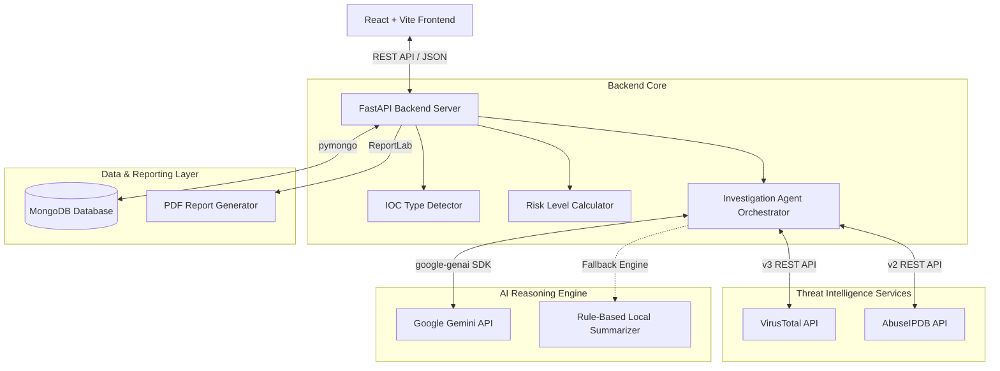

# AI SOC Incident Investigation Agent

A full-stack, AI-powered Security Operations Center (SOC) incident investigation platform designed to automate Tier 1 & Tier 2 triage workflows. The system autonomously ingests Indicators of Compromise (IOCs)—including IP addresses, domains, URLs, and file hashes—queries live threat intelligence feeds (VirusTotal and AbuseIPDB), computes severity risk scores, synthesizes threat telemetry using Google Gemini AI, and generates downloadable PDF incident reports.

---

## Project Overview

Modern Security Operations Centers (SOCs) face an overwhelming volume of security alerts daily. Security analysts spend hours manually copying Indicators of Compromise (IOCs), querying multiple external threat intelligence lookup tools, collating reputation scores, and manually drafting incident investigation notes.

The **AI SOC Incident Investigation Agent** automates this entire pipeline into a single, high-speed execution flow:
1. **Automated Detection**: Accepts raw IOC strings and automatically determines whether the target is an IPv4 Address, Domain, URL, MD5 Hash, SHA1 Hash, or SHA256 Hash.
2. **Multi-Source Threat Orchestration**: Concurrently queries **VirusTotal v3 API** (for global detection statistics) and **AbuseIPDB v2 API** (for IP reputation and reporting history).
3. **Deterministic Severity Scoring**: Applies rule-based risk calculations to classify threats into Low, Medium, High, or Critical risk tiers.
4. **LLM Threat Synthesis**: Utilizes **Google Gemini AI** (`gemini-2.0-flash`, `gemini-2.5-flash`, or `gemini-1.5-flash`) to generate structured executive summaries containing an **Overall Assessment**, **Threat Rationale**, and **Recommended Next Actions**.
5. **Persistence & Auditing**: Stores complete investigation records in **MongoDB** (with automatic in-memory fallback if database service is unattached).
6. **Executive Reporting**: Generates black-and-white printable A4 **PDF Incident Reports** via ReportLab and allows one-click clipboard copying for ticketing systems.

---

## Problem Statement

Security analysts operating in enterprise SOCs encounter several critical operational challenges:
- **Alert Fatigue**: Enterprise SIEMs produce thousands of alerts daily. Over 70% of an analyst's shift is consumed by repetitive manual lookup steps.
- **Inconsistent Incident Notes**: Human analysts summarize findings differently across shifts, leading to inconsistent incident documentation and missed context during escalation.
- **Context Switching Overhead**: Analysts must jump between VirusTotal, AbuseIPDB, WHOIS lookup tools, internal SIEM consoles, and ticketing platforms (Jira/ServiceNow).
- **Delayed Response Times (MTTR)**: Manual correlation inflates Mean Time to Respond (MTTR), giving malicious actors a broader window to move laterally or exfiltrate data.

---

## Why This Problem?

In cybersecurity, speed is paramount. Cyber threats operate at machine speed; human manual analysis operates at linear human speed. Automating the ingestion, threat intelligence enrichment, and initial AI reasoning phase allows SOC teams to:
- Reduce Tier 1 triage time from 15–30 minutes per IOC to **under 5 seconds**.
- Standardize documentation across all security incidents.
- Empower junior security analysts with senior Tier 3 threat reasoning recommendations.
- Focus human expertise on remediation, containment, and threat hunting rather than manual data gathering.

---

## Objectives

- **Automate Ingestion & Classification**: Eliminate manual data entry by automatically identifying IOC formats via regular expressions and URL parsers.
- **Orchestrate Threat Feeds**: Aggregate multi-source intelligence from VirusTotal and AbuseIPDB in parallel.
- **Deliver Actionable AI Summaries**: Synthesize complex JSON responses into clear, authoritative SOC analyst recommendations using Google Gemini AI.
- **Ensure High Availability**: Provide resilient local fallback mechanisms (in-memory history storage and local rule-based AI fallback summaries) so the application remains 100% functional even under API rate limits or network disruptions.
- **Support Compliance & Auditability**: Maintain a searchable historical database of all triaged incidents and support PDF incident report generation.

---

## Key Features

- **AI-Assisted IOC Investigation**: Automates end-to-end triage of IP addresses, domains, URLs, and file hashes.
- **Automatic IOC Type Detection**: Instantly identifies IPv4, Domain, URL, MD5, SHA1, and SHA256 formats without manual user selection.
- **VirusTotal Integration**: Queries VirusTotal v3 API for malicious, suspicious, harmless, and undetected engine stats.
- **AbuseIPDB Integration**: Queries AbuseIPDB v2 API for IP abuse confidence scores, report counts, ISP data, and country location.
- **Google Gemini AI Summary**: Uses Gemini models to generate plain-text structured analyst reasoning (`OVERALL ASSESSMENT`, `THREAT RATIONALE`, `RECOMMENDED NEXT ACTIONS`).
- **Risk Level Assessment**: Computes deterministic severity tiers (`Low`, `Medium`, `High`, `Critical`) based on detection thresholds.
- **Investigation History (MongoDB)**: Persists all completed investigations into MongoDB (with automatic in-memory fallback), sorted newest first.
- **SOC Dashboard**: Displays aggregate metrics (Total Investigations, High/Critical Threat counts, Clean IOCs, Average Risk Score) alongside distribution charts.
- **PDF Incident Report Generation**: Generates clean, printable A4 PDF reports via ReportLab with one-click download.
- **Copy Incident Report**: One-click formatted plain-text copy functionality for pasting directly into Jira, ServiceNow, or Slack.
- **Responsive Cyberpunk UI**: Modern dark-mode interface built with React, Vite, Lucide icons, and Tailwind CSS.
- **Error Handling**: Graceful handling for API failures, rate limiting (HTTP 429), missing keys, and database connection timeouts.

---

## AI Agent Workflow

```
[ User Enters IOC ] 
        │
        ▼
[ Automatic IOC Type Detection ]
        │
        ├── IP Address ─────► [ VirusTotal IP Lookup ] + [ AbuseIPDB IP Check ]
        ├── Domain ─────────► [ VirusTotal Domain Lookup ]
        ├── URL ────────────► [ VirusTotal URL Lookup ]
        └── File Hash ──────► [ VirusTotal File Hash Lookup ]
        │
        ▼
[ Risk Level Calculation ] (Low / Medium / High / Critical)
        │
        ▼
[ Google Gemini AI Synthesis ]
        │ (Falls back to Local Rule-Based Summarizer if API Rate-Limited/Offline)
        ▼
[ Save Document to MongoDB / In-Memory Store ]
        │
        ▼
[ Render Results in UI ] (Interactive View, Copy Report, PDF Download)
```

1. **User Ingestion**: The analyst inputs an IOC string (e.g. `198.51.100.44`, `c2-exfil-node.ru`, `e3b0c44...`) in the New Investigation wizard.
2. **Format Classification**: `ioc_detector.py` evaluates the string using pattern matching and scheme parsers to detect the IOC type.
3. **Tool Execution & Enrichment**:
   - For **IP Addresses**: Calls VirusTotal `/ip_addresses/{ip}` and AbuseIPDB `/check`.
   - For **Domains**: Calls VirusTotal `/domains/{domain}`.
   - For **URLs**: Encodes URL to base64 identifier and calls VirusTotal `/urls/{url_id}`.
   - For **File Hashes**: Calls VirusTotal `/files/{hash}`.
4. **Risk Assessment**: `calculate_risk_level()` counts total malicious detections and categorizes severity:
   - `0` detections $\rightarrow$ **Low**
   - `1 - 4` detections $\rightarrow$ **Medium**
   - `5 - 15` detections $\rightarrow$ **High**
   - `> 15` detections $\rightarrow$ **Critical**
5. **LLM Threat Analysis**: Aggregated payload is sent to Google Gemini (`gemini-2.0-flash`, `gemini-2.5-flash`, `gemini-1.5-flash`). If API limits are exceeded, the local fallback engine generates structured threat rationale.
6. **Persistence & Presentation**: Record is saved with a unique ID and displayed in the frontend with options to view logs, copy summary, or download PDF report.

---

## System Architecture



---

## Technology Stack

### Frontend
- **Framework**: React 18
- **Build Tool**: Vite 5
- **Styling**: Tailwind CSS, Vanilla CSS
- **Icons**: Lucide React
- **HTTP Client**: Axios
- **Charts**: Recharts

### Backend
- **Framework**: FastAPI (Python 3.10+)
- **Server**: Uvicorn
- **Validation**: Pydantic v2
- **Environment Management**: python-dotenv

### Database
- **Primary**: MongoDB (via PyMongo)
- **Fallback**: In-Memory Thread-Safe Python Storage

### AI & Threat Intelligence
- **AI Model**: Google Gemini (`gemini-2.0-flash`, `gemini-2.5-flash`, `gemini-1.5-flash`) via `google-genai` SDK
- **Threat Feeds**: VirusTotal v3 REST API, AbuseIPDB v2 REST API

### PDF Generation
- **Engine**: ReportLab (A4 printable layout, custom flowables, tables)

### Development Tools
- **Package Manager**: npm (Frontend), pip (Backend)
- **Version Control**: Git

---

## Project Structure

```
soc-ai-agent/
├── backend/
│   ├── app/
│   │   ├── agents/
│   │   │   └── investigation_agent.py
│   │   ├── api/
│   │   │   ├── dashboard.py       # GET /dashboard/stats
│   │   │   ├── history.py         # GET/DELETE /history endpoints
│   │   │   ├── investigation.py   # POST /investigate endpoint
│   │   │   └── report.py          # GET /report/pdf/{id} endpoint
│   │   ├── database/
│   │   │   └── database.py        # MongoDB connection & CRUD logic
│   │   ├── models/
│   │   │   └── investigation.py   # Pydantic request/response schemas
│   │   ├── services/
│   │   │   ├── abuseipdb_service.py   # AbuseIPDB API integration
│   │   │   ├── gemini_service.py      # Google Gemini API & fallback
│   │   │   ├── pdf_service.py         # ReportLab PDF generator
│   │   │   └── virustotal_service.py  # VirusTotal v3 API integration
│   │   ├── utils/
│   │   │   └── ioc_detector.py        # Regex IOC type detector
│   │   ├── config.py             # Environment configuration
│   │   └── main.py               # FastAPI application entry point
│   ├── .env                      # API keys & Database configuration
│   ├── requirements.txt          # Python dependencies
│   └── README.md
├── frontend/
│   ├── src/
│   │   ├── components/
│   │   │   ├── common/
│   │   │   │   └── Badge.jsx
│   │   │   ├── dashboard/
│   │   │   ├── history/
│   │   │   │   ├── FilterBar.jsx
│   │   │   │   └── HistoryTable.jsx
│   │   │   ├── investigation/
│   │   │   │   ├── InvestigationProgress.jsx
│   │   │   │   ├── InvestigationResults.jsx
│   │   │   │   ├── InvestigationWizard.jsx
│   │   │   │   ├── LogViewer.jsx
│   │   │   │   └── SimulationModal.jsx
│   │   │   └── layout/
│   │   │       ├── Header.jsx
│   │   │       ├── Layout.jsx
│   │   │       └── Sidebar.jsx
│   │   ├── pages/
│   │   │   ├── DashboardPage.jsx
│   │   │   ├── InvestigationHistoryPage.jsx
│   │   │   ├── NewInvestigationPage.jsx
│   │   │   └── SettingsPage.jsx
│   │   ├── services/
│   │   │   └── api.js            # Axios API wrappers
│   │   ├── App.jsx               # React main app component
│   │   ├── index.css             # Tailwind base styles
│   │   └── main.jsx              # React DOM entrypoint
│   ├── index.html
│   ├── package.json
│   ├── tailwind.config.js
│   └── vite.config.js
└── README.md
```

---

## Installation

### Prerequisites
- **Node.js**: v18.x or higher
- **Python**: v3.10 or higher
- **MongoDB**: Local MongoDB instance (`mongodb://localhost:27017`) or MongoDB Atlas (Optional; system defaults to in-memory mode if MongoDB is not running).

### 1. Clone Repository
```bash
git clone https://github.com/your-org/soc-ai-agent.git
cd soc-ai-agent
```

### 2. Backend Setup
```bash
cd backend

# Create virtual environment
python -m venv venv

# Activate virtual environment
# On Windows:
venv\Scripts\activate
# On Linux/macOS:
source venv/bin/activate

# Install dependencies
pip install -r requirements.txt
```

### 3. Environment Variables
Create a `.env` file in the `backend/` directory:
```env
VIRUSTOTAL_API_KEY=your_virustotal_api_key_here
ABUSEIPDB_API_KEY=your_abuseipdb_api_key_here
GEMINI_API_KEY=your_gemini_api_key_here
MONGODB_URI=mongodb://localhost:27017
DATABASE_NAME=soc_ai_agent
```

### 4. Frontend Setup
```bash
cd ../frontend
npm install
```

### 5. Running Backend
From `backend/` directory with virtual environment activated:
```bash
uvicorn app.main:app --reload
```
Backend API will start at: `http://127.0.0.1:8000` (Interactive API docs at `http://127.0.0.1:8000/docs`).

### 6. Running Frontend
From `frontend/` directory:
```bash
npm run dev
```
Frontend web application will open at: `http://localhost:5173`.

---

## API Endpoints

### 1. Execute Investigation
- **Endpoint**: `POST /investigate`
- **Description**: Triggers IOC type detection, external threat feed API calls (VirusTotal & AbuseIPDB), risk computation, Gemini AI analysis, and saves record to database.
- **Request Body**:
  ```json
  {
    "ioc": "198.51.100.44"
  }
  ```
- **Response** (`200 OK`):
  ```json
  {
    "id": "66b12f8e9a2b1c0012345678",
    "ioc": "198.51.100.44",
    "ioc_type": "IP Address",
    "risk_level": "High",
    "virustotal": {
      "malicious": 8,
      "suspicious": 2,
      "harmless": 65,
      "undetected": 10,
      "reputation": -15
    },
    "abuseipdb": {
      "abuseConfidenceScore": 100,
      "countryCode": "US",
      "isp": "Example Hosting LLC",
      "usageType": "Data Center/Web Hosting/Transit",
      "totalReports": 450,
      "lastReportedAt": "2026-08-04T12:00:00+00:00"
    },
    "ai_summary": "OVERALL ASSESSMENT:\nTarget IP 198.51.100.44 presents a HIGH Risk posture...\n\nTHREAT RATIONALE:\nVirusTotal records 8 malicious engines...\n\nRECOMMENDED NEXT ACTIONS:\n1. Immediately block IP at edge firewall."
  }
  ```

---

### 2. Retrieve Investigation History
- **Endpoint**: `GET /history`
- **Description**: Fetches all saved investigation records sorted newest first.
- **Response** (`200 OK`): List of investigation objects.

---

### 3. Retrieve Single Investigation Record
- **Endpoint**: `GET /history/{id}`
- **Description**: Fetches a single investigation document by MongoDB `_id` or memory ID string.
- **Response** (`200 OK`): Investigation record object.

---

### 4. Delete Investigation Record
- **Endpoint**: `DELETE /history/{id}`
- **Description**: Deletes a specific investigation record from history storage.
- **Response** (`200 OK`):
  ```json
  {
    "status": "success",
    "message": "Investigation record '66b12f8e9a2b1c0012345678' deleted successfully.",
    "id": "66b12f8e9a2b1c0012345678"
  }
  ```

---

### 5. Get Dashboard Statistics
- **Endpoint**: `GET /dashboard/stats`
- **Description**: Computes aggregate SOC operational metrics (total investigations, risk distribution counts, top threat indicators) directly from database.
- **Response** (`200 OK`):
  ```json
  {
    "total_investigations": 12,
    "high_critical_count": 4,
    "clean_count": 5,
    "avg_risk_score": 42.5,
    "risk_distribution": [
      { "name": "Low", "value": 5 },
      { "name": "Medium", "value": 3 },
      { "name": "High", "value": 3 },
      { "name": "Critical", "value": 1 }
    ]
  }
  ```

---

### 6. Download PDF Incident Report
- **Endpoint**: `GET /report/pdf/{investigation_id}`
- **Description**: Generates and streams a printable A4 PDF report file.
- **Response** (`200 OK`): Binary stream (`application/pdf`) with `Content-Disposition: attachment; filename="SOC_Incident_Report_198.51.100.44.pdf"`.

---


## Testing

The system was evaluated using diverse operational test cases across benign, malicious, and edge-case samples:

| Test Case | Target Input | Expected IOC Type | Expected Result | Status |
| :--- | :--- | :--- | :--- | :--- |
| **Benign IP** | `8.8.8.8` | IP Address | Low Risk (0 VT detections, low abuse score) | **Passed** |
| **Malicious Hash** | `e3b0c44298fc1c149afbf4c8996fb92427ae41e4649b934ca495991b7852b855` | SHA256 Hash | High/Critical Risk, VirusTotal file analysis returned | **Passed** |
| **Rogue Domain** | `c2-exfil-node.ru` | Domain | Domain lookup executed, VT engine reputation parsed | **Passed** |
| **History Retrieval** | `GET /history` | N/A | Returned saved records in descending timestamp order | **Passed** |
| **Dashboard Stats** | `GET /dashboard/stats` | N/A | Correctly aggregated total counts and risk distributions | **Passed** |
| **PDF Generation** | `GET /report/pdf/{id}` | N/A | Downloaded valid 1-page/2-page formatted A4 PDF report | **Passed** |
| **Offline DB Fallback** | Disconnected MongoDB | N/A | Gracefully fell back to in-memory store without crashing | **Passed** |
| **API Limit Fallback** | Exhausted Gemini quota | N/A | Generated local rule-based SOC analyst fallback summary | **Passed** |

---

## Assumptions

- **API Key Availability**: Assumes valid API keys for VirusTotal, AbuseIPDB, and Google Gemini are placed in `backend/.env`. If missing, fallback handlers provide synthetic or local estimates.
- **Network Connectivity**: Assumes outbound HTTP access to `virustotal.com`, `abuseipdb.com`, and `generativelanguage.googleapis.com`.
- **IPv4 Target Scope**: AbuseIPDB check endpoints are executed specifically for IPv4 targets.
- **Single-Tenant Workspace**: Designed as a dedicated SOC analyst tool without multi-tenant RBAC barriers for hackathon evaluation.

---

## Limitations

- **Rate Limits on Free API Tiers**: VirusTotal Public API enforces 4 requests/minute limit. AbuseIPDB free key enforces 1,000 requests/day.
- **No Active Sandboxing**: Does not execute malware files in dynamic hypervisor sandboxes (e.g. ANY.RUN, Cuckoo); relies on static intelligence aggregation.
- **Local Fallback Data Persistence**: In-memory fallback history resets upon backend process restart if MongoDB is not connected.

---

## Future Improvements

- **Email Alerts**: Automatic SMTP / SendGrid escalation notifications when Critical risk IOCs are triaged.
- **MITRE ATT&CK Mapping**: Automatic mapping of detected threat behaviors to MITRE ATT&CK Enterprise TTP tactics and techniques.
- **YARA Integration**: Ability to upload custom YARA rules to scan file payloads against internal rule repositories.
- **Threat Feed Correlation**: Integration with AlienVault OTX, CrowdStrike Falcon, and MISP threat intelligence platforms.
- **IOC Relationship Graph**: Visual interactive graph node representation connecting malicious IPs, domains, and sample hashes.
- **Multi-User Authentication**: JWT-based Role-Based Access Control (RBAC) supporting Analyst, Senior Lead, and Admin roles.
- **SIEM Integration**: Direct webhooks for Splunk, Microsoft Sentinel, and Elastic Security alert ingestion.
- **Playbook Automation**: SOAR-style automated blocklist execution for Palo Alto Networks, Fortinet, and AWS WAF.

---

## Hackathon Highlights

### Why This Is an AI Agent (Not Just an LLM Wrapper)
Many hackathon submissions wrap an LLM prompt around static user input. The **AI SOC Incident Investigation Agent** functions as an **autonomous goal-driven agent**:

1. **Autonomous Tool Orchestration**: The agent dynamically selects which external diagnostic APIs to invoke based on structural pattern recognition (`IP Address` $\rightarrow$ VT + AbuseIPDB; `File Hash` $\rightarrow$ VT File Endpoint).
2. **Multi-Source Threat Correlation**: Merges disparate unstructured and structured data sources into a normalized state vector before invoking LLM reasoning.
3. **Reasoning Under Constraints**: Employs deterministic fallback logic when LLM quotas are depleted, maintaining unbroken operational uptime.
4. **Cybersecurity Decision Support**: Rather than producing conversational text, the agent generates structured operational directives (`OVERALL ASSESSMENT`, `THREAT RATIONALE`, `RECOMMENDED NEXT ACTIONS`) tailored for enterprise incident response.

---

## Contributing

1. Fork the repository (`https://github.com/your-org/soc-ai-agent/fork`).
2. Create your feature branch (`git checkout -b feature/AmazingFeature`).
3. Commit your changes (`git commit -m 'Add some AmazingFeature'`).
4. Push to the branch (`git push origin feature/AmazingFeature`).
5. Open a Pull Request.

---

## License

Distributed under the **MIT License**. See `LICENSE` for more information.

---

## Acknowledgements

- [VirusTotal API v3](https://www.virustotal.com/) - Global threat intelligence file and network telemetry.
- [AbuseIPDB API v2](https://www.abuseipdb.com/) - IP address abuse report registry.
- [Google Gemini API](https://ai.google.dev/) - Next-generation multimodal AI reasoning engine.
- [FastAPI](https://fastapi.tiangolo.com/) - High-performance Python Web framework for APIs.
- [React](https://react.dev/) & [Vite](https://vitejs.dev/) - Ultra-fast frontend development stack.
- [MongoDB](https://www.mongodb.com/) - Scalable document database.
- [ReportLab](https://www.reportlab.com/) - Open-source PDF generation engine for Python.
